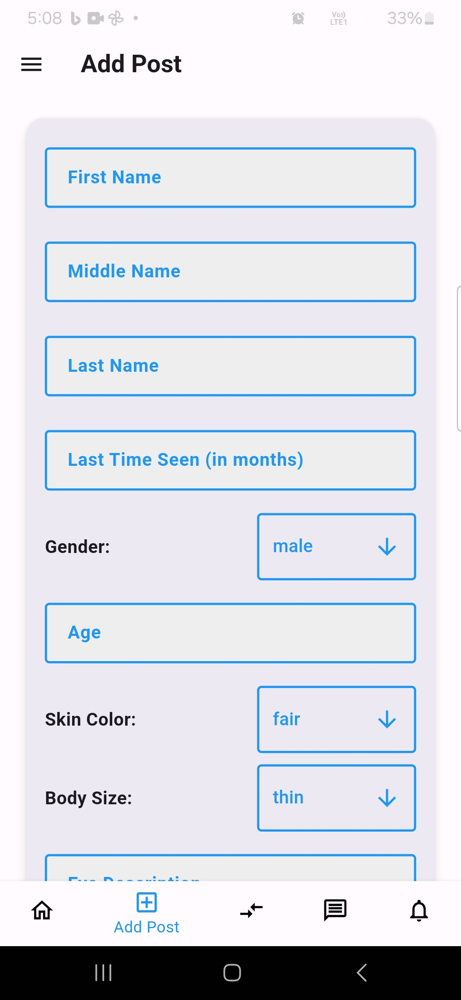
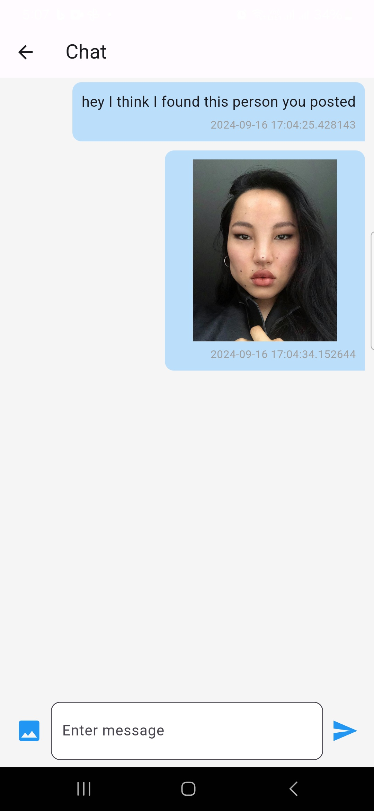

<div align="center">
  <h1>🚧 Facial Recognition Missing Person Finder</h1>
</div>

> An intelligent tool leveraging **facial recognition** to locate missing persons.

<div align="center">
  
</div>


> **Final Year Project** | Software Engineering at AASTU

This project aims to help in **search and rescue operations** by leveraging **facial recognition technology** to assist in finding missing persons. The system supports **image-based searches**, filtering, and real-time notifications.

---

## 📑 Table of Contents

[🧐 About](#-about)

[✨ Key Features](#-key-features)

[💻 Technologies Used](#-technologies-used)

[⚙ Getting Started](#-getting-started)

[🚀 Usage](#-usage)

[🤝 Contributing](#-contributing)

[📜 License](#-license)

---

## 🧐 About

This repository contains the source code and documentation for the **Facial Recognition Missing Person Finder**, a tool developed as part of the final year project for a Bachelor's degree in Software Engineering at **AASTU**.

The goal is to leverage advanced **facial recognition** and **text matching** to locate missing individuals. It serves as a valuable tool for **search and rescue teams**, enhancing their efficiency and outreach.

---

## ✨ Key Features

**📄 Submit Missing Person Posts**: Easily create a post about a missing person, visible to everyone.

**💬 Profile Chatting**: Message the person who posted the missing case directly from the profile.

**🔍 Image & Feature-Based Search**: Search for missing persons using **image recognition** or by filtering based on age, name, gender, and more.

**🎛 Filtering Options**: Narrow down your search by specifying features such as age, weight, gender, and skin color.

**🔗 Matching**: Input individual descriptions to receive possible matches with a confidence score based on database entries.

**⚙️ Case Management**: Keep track of all the cases you’ve posted and update them as necessary.

**📬 Notifications**: Receive real-time updates when new cases are added, or statuses change.

**🛠 Admin Dashboard**: Allows admins to manage users, monitor cases, and review logs.

---

## 💻 Technologies Used

**Frontend**:

🟦 React

🎨 Tailwind CSS

📱 Flutter

🔥 Firebase

**Backend**:


🟩 Node.js

🍃 MongoDB

**Facial Recognition**:

🖼 Open-source `face-api.js` for facial recognition

**Description Matching**:

📝 Transformers for text and description matching

---

## ⚙ Getting Started

Here’s how to get a local copy of the project running on your machine.

### Prerequisites

Ensure you have the following installed:
- [Node.js](https://nodejs.org/)
- [MongoDB](https://www.mongodb.com/)
- [Flutter SDK](https://flutter.dev/docs/get-started/install)

### Installation

1. **Clone the repository**:
   ```bash
   git clone https://github.com/CapStoneProject-Missing-People/Missing-individual.git
   cd Missing-individual
   ```

2. **Backend Setup**:

   - Navigate to `missingFeature`:
     ```bash
     cd missingFeature
     npm install
     ```

   - Create a `.env` file with the following:
     ```
     dbUri=your-mongodb-connection-string
     PORT=4000
     PRIV_KEY=your-private-key-for-jwt
     ACCESS_TOKEN_SECRET=your-access-token-secret
     ```

   - Start the backend server:
     ```bash
     npm start
     ```

   - Open a new terminal and navigate to `face-recognition/`:
     ```bash
     cd face-recognition
     npm install
     ```

   - Create another `.env` file:
     ```
     dbUri=your-mongodb-connection-string
     PORT=6000
     ```

   - Start the face recognition service:
     ```bash
     npm start
     ```

3. **Frontend Setup**:

   - Navigate to the Flutter app directory:
     ```bash
     cd Frontend/missingpersonapp
     flutter pub clean
     flutter pub get
     ```

   - In `Frontend/missingpersonapp/lib/features/authentication/utils/constants.dart`, add:
     ```dart
     const String postUri = 'http://localhost:4000';
     const String faceApi = 'http://localhost:6000';
     const String wsUri = 'localhost:4000';
     ```

   - Run the Flutter app:
     ```bash
     flutter run
     ```

> **Note**: If using a physical device, ensure it is connected to the same Wi-Fi as the server and replace `localhost` with your machine’s IP address.

---

## 🚀 Usage

### How to Use the App

1. **Post a Case**: Navigate to the **Post Case** section, upload a photo and enter the missing person's details.
2. **Search for a Missing Person**: Search by uploading a photo or entering details like name, age, and gender.
3. **Receive Notifications**: Get notifications on case updates or status changes.

---

## 🤝 Contributing

We welcome contributions! Feel free to **open issues** or submit **pull requests** to improve this project.

---

**Screenshots and Demo**

<!-- Add images or GIF/video demo here -->
<table align="center">
  <tr>
  <td></td>
  <td></td>
</tr>
</table>

---

### 🎥 Watch the demo on Youtube:

> **Note**: If you'd like to open the video or link in a new tab, you can right-click the link and select **"Open link in new tab"**, or use **Ctrl + Click** (on Windows/Linux) or **Cmd + Click** (on macOS).

<a href="https://www.youtube.com/watch?v=pBoSRwMv704" target="_blank">
  click here
  
</a>

---

**Contact**: [Leulseged B. Ayalew](mailto:leulbekele191@gmail.com)
             [Dawit Yenew](mailto:dawityenew.12@gmail.com)

---

## 📜 License
Apache-2.0 license

